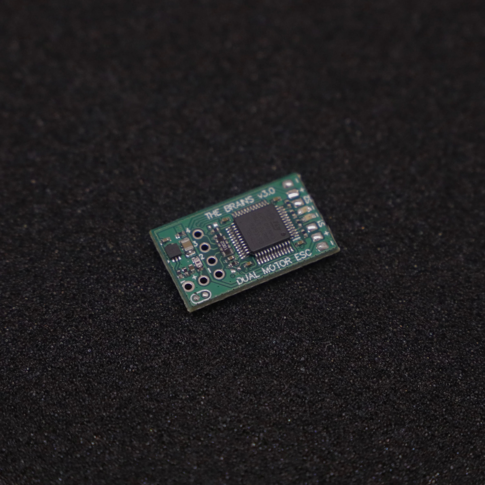
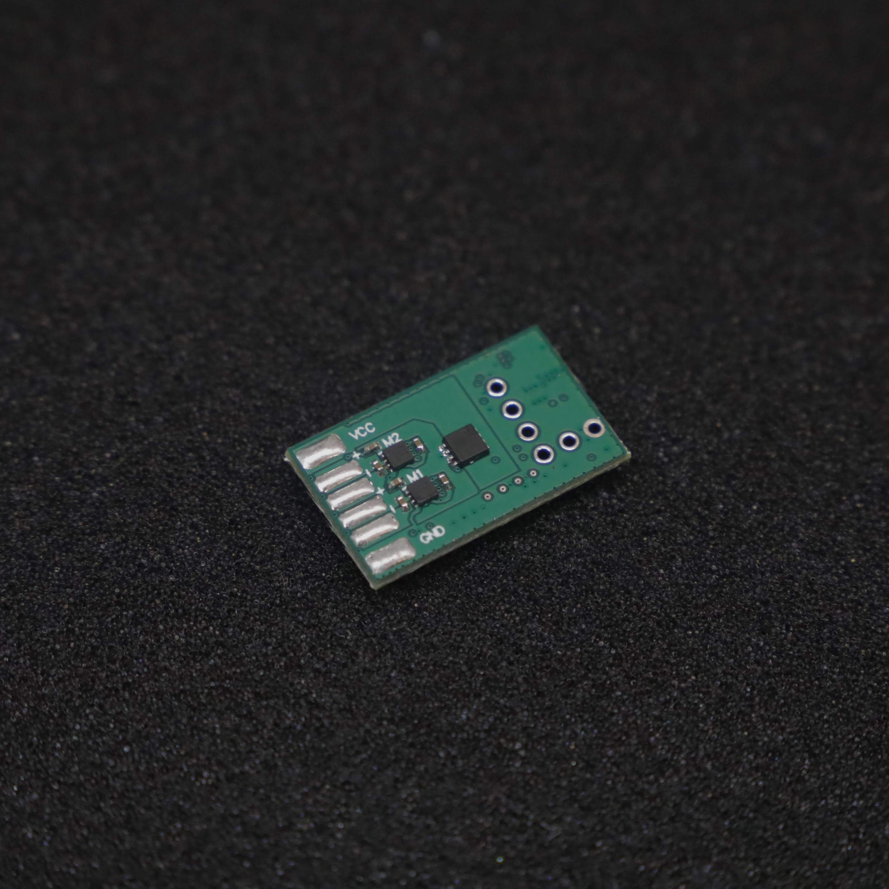

# THE BRAINS v4.0

 

THE BRAINS is an compact and lightweight dual DC-motor ESC: originally designed for antweight combat robots, but is suitable for any appliction requiring a lightweight motor driver.

Designed and built in [Christchurch, New Zealand ](https://www.google.co.nz/maps/place/Christchurch+New+Zealand) by Connor Benton, visit [cb-technology](https://www.cb-technology.co.nz/) for details.

## FEATURES

- 2x Bi-Directional DC motor outputs.
- 2x Signal output channels for additional electroncis (BLDC ESC, servo, etc).
- Status LED's to indicate run mode, faults and calibration.
- Under-voltage, over-current, over-temperature, and reverse polarity protections.
- Internal BEC to provide power to the radio reciever.
- Failsafe checks for loss of connection with radio.
- Auto-Detection of different radio protocols on the same input.
- Instant brown-out recovery.
- Calibrate function to customise drive mode, channel mapping, and channel inversion.
- Includes a 100nF capacitor across each motor to filter noise and voltage spikes.

## SPECIFICATIONS

- **Dimensions:** 25x19x3 mm
- **Weight:** 2g *excluding wires*
- **Input Voltage - Rated:** 2S lipo (6-10.4V)
- **Input Voltage - Max:** 12.0V
- **Motor Output:** 2.1A cont (3A peak) per channel 
- **BEC:** 5V, 80mA. Designed to power the radio reciever but no motors or servos
- **Signal Input:** Servo PWM, PPM, IBUS, SBUS
- **Signal Mixing:** Onboard signal mixing for TANK/ARCADE drive styles and channel mapping + inverting
- **Signal Output:** Servo PWM 
   
## Status LEDs
There are two LEDs on THE BRAINS (1x red, 1x green) and the behaviour of each indicate what state the device is in.
 - **Normal Operation** Green: ON, Red: OFF
 - **Fault Conditions**
    - **Signal-Input** Green: FLASH, Red: OFF
    - **Under-Voltage** Green: OFF, Red: FLASH (1Hz)
    - **Over-Temperature** Green: OFF, Red: FAST FLASH (5Hz)
 - **Calibration** Green: PATTERN, Red: PATTERN. (See Calibration section for specific LED patterns) 

## Fault Conditions
In all of the following fault conditions, all drive/output signals are stopped no matter the input signals. Once the fault condition is resolved, functionality will resume immediately. 
 - **Under-Voltage:** An under-voltage event occurs if the battery voltage falls below 3.2V (per cell). 
 - **Over-Temperature:** An over-temperature event occurs when the temperature sense circuit on THE BRAINS reaches 100°C.
 - **Signal-Input:** A signal-input fault occurs if the signal between the THE BRAINS and the radio reciever is lost. Note: You still need to set the failsafe on the radio reciever to detect loss of connection with the transmitter.

## Calibration
###### Calibration Parameters
THE BRAINS has a number of calibration parateters that are can be chosen from, these are:
- **Input Signal:**
At no point should the operator have to manually set the protocol, this will be auto-detected without the operator knowing.
    - Servo PWM (standard 1-2ms pulse)
    - PPM
    - IBUS
    - SBUS
- **Driving Mode:**
    - Tank (Each motor speed is controlled by a different input)
    - Arcade (One input controls both motor speeds and another is mixed in to control the steering) 
- **Signal Mapping:**
    - Any input channel can be mapped to any of the 4 outputs (2x motors + 2x signal output). 
    - Any channel can be reversed (usually auto-detected during the calibration procedure). 

The default calibration parameters are:
- **Input Signal:** SBUS
- **Driving Mode:** TANK
- **Signal Mapping:** 
     - Ch1 = Motor1, 
     - Ch2 = Motor2,
     - Ch3 = Servo1,
     - Ch4 = Servo2,

###### Calibration Procedure
 1. Ensure the transmitter is turned ON, it has been bound to the radio reciever, and all sticks are in their zero (neutral) position.

 2. Plug the radio reciever and motors into THE BRAINS. 
 It is important that the motors are connected in the orientation used for the final robot, this will allow auto-detection of the channel mapping and inversion during the following Simon-says process.

 3. Turn THE BRAINS ON and, within 10 seconds, trigger the calibration procedure using one of the following:
    - Short-circuit the two calibration pads on the underside. 
    These pads are the two circular pads close together and circled with silkscreen.
    - Wiggle any input on the transmitter back and forward 10 times. 
    Make sure to push the stick from CENTER all the way to MAX/MIN when wiggling. 

 4. Both status LEDs will pulse 10 times and then stay fully illumintaed to indicated THE BRAINS has entered CALIBRATION mode and is ready to begin the Simon-Says process. 

 5. When ready, push any stick on the transmitter to MAX and back to CENTER.
 The rest of the calibration happens pretty quickly so please read, and understand, steps 6 + 7 before proceeding. 

 6. Both status LED's will turn OFF and the Simon-says motor calibration procedure is started. 
    - Two tests are run, each will twitch the two motors and cause the robot to move forward, reverse, left, or right. 
    The user must then input that motion back into the remote. eg:
        - Robot twitches forward: Tank drive, simualtaneously push both sticks forward. Arcarde drive, push one stick forward.
        - Robot twitches left: Tank drive, simualtaneously push left stick back and right forward. Arade drive, push one stick left
    - The process for each test is:
        1. Both LED's turn OFF
        2. The motor twitches
        3. Red LED turns ON
        4. User presses input(s) to MAX/MIN
        5. Green LED turns ON 
        6. User returns input(s) back to CENTER
        7. Both LED's pulse 3 times to indicate success
        8. Repeat for second test

 7. Both status LED's will again turn OFF and the Simon-says output signal calibration procedure is started. 
    - Two more tests are run to map the inputs to the Signal 1 and 2 outputs. The primary difference with this test is that no motor are driven, THE BRAINS is just monitoring the inputs.
    - The process for each test is:
        1. Both LED's will momentrarily turn OFF to indicate the test has started
        2. Red LED turns ON
        3. User presses the input (to MAX/MIN) they want mapped to output signal 1
        4. Green LED turns ON
        5. User returns input back to CENTER 
        6. Both LED's pulse 3 times to indicate success
        7. Repeat for output signal 2.

 12. Calibration Complete
     - Both status LEDs will pulse 10 times to indicate a successfull calibration.
     - Once the LED pulses are complete, THE BRAINS immediately enter Run mode with the new calibration.
     - If THE BRAINS is turned OFF before completing the calibration process, NONE of the new parameters are stored and it will revert to the previous configuraion. 
